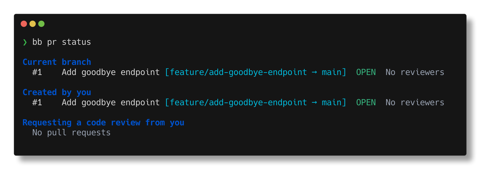

# bb — Bitbucket Cloud CLI

A fast, interactive command-line interface for Bitbucket Cloud. Manage repositories, pull requests, and pipelines without leaving your terminal.



## Install

### Homebrew

```sh
brew install tyrantkhan/tap/bb
```

### mise

```sh
mise use -g ubi:tyrantkhan/bitbucket-cli[exe=bb]
```

### Script

```sh
curl -sSL https://tyrantkhan.github.io/bitbucket-cli/install.sh | sh
```

### From source

```sh
go install github.com/tyrantkhan/bb@latest
```

### Binary releases

Download from [GitHub Releases](https://github.com/tyrantkhan/bitbucket-cli/releases).

> **macOS note:** Pre-built binaries are not yet code-signed. On macOS you will need to remove the quarantine attribute after downloading:
>
> ```sh
> xattr -d com.apple.quarantine /path/to/bb
> ```

## Quick start

```sh
# Authenticate (interactive — choose OAuth or API token)
bb auth login

# List repos in your workspace
bb repo list

# View open pull requests
bb pr list

# Create a pull request from the current branch
bb pr create

# Run a pipeline
bb pipeline run
```

## Authentication

Two methods are available:

**OAuth (recommended)** — opens your browser, no setup required:

```sh
bb auth login --web
```

**API token** — paste an [Atlassian API token](https://id.atlassian.com/manage-profile/security/api-tokens):

```sh
bb auth login --api-token
```

bb has no backend or servers. All requests go directly from your machine to the Bitbucket API. Your credentials are stored locally in `~/.config/bb/credentials.json` and never leave your device.

## Commands

### Auth

| Command | Description |
|---|---|
| `bb auth login` | Authenticate with Bitbucket Cloud |
| `bb auth logout` | Remove stored credentials |
| `bb auth status` | Show authentication status |

### Repositories

| Command | Description |
|---|---|
| `bb repo list` | List repositories in a workspace |
| `bb repo view [slug]` | View repository details |
| `bb repo create` | Create a new repository |
| `bb repo clone <slug>` | Clone a repository |

### Pull Requests

| Command | Description |
|---|---|
| `bb pr list` | List pull requests |
| `bb pr view <id>` | View pull request details |
| `bb pr create` | Create a pull request |
| `bb pr merge <id>` | Merge a pull request |
| `bb pr approve <id>` | Approve a pull request |
| `bb pr decline <id>` | Decline a pull request |
| `bb pr comment <id>` | Add a comment |
| `bb pr diff <id>` | Show the diff |
| `bb pr activity <id>` | Show activity feed |
| `bb pr status` | Show status of relevant PRs |

### Pipelines

| Command | Description |
|---|---|
| `bb pipeline list` | List pipelines |
| `bb pipeline view <uuid>` | View pipeline details |
| `bb pipeline run` | Run a pipeline |
| `bb pipeline stop <uuid>` | Stop a running pipeline |
| `bb pipeline logs <uuid>` | View step logs (with `--follow`) |

## Smart defaults

bb detects context from your git repository:

- **Workspace** and **repo** are inferred from your git remote
- **Source branch** defaults to your current branch when creating PRs
- **Destination branch** defaults to `main`

You can always override with `--workspace` / `--repo` flags.

## Output formats

```sh
# Default: colored table output
bb pr list

# JSON for scripting
bb pr list --format json

# Open in browser
bb pr view 42 --web
```

## Configuration

Config is stored at `~/.config/bb/config.yml`:

```yaml
default_workspace: myworkspace
default_format: table
```

### Environment variables

| Variable | Description |
|---|---|
| `BB_CLIENT_ID` | Override OAuth consumer key |
| `BB_CLIENT_SECRET` | Override OAuth consumer secret |
| `NO_COLOR` | Disable color output |

## Full reference

```sh
bb reference
```

## License

MIT
